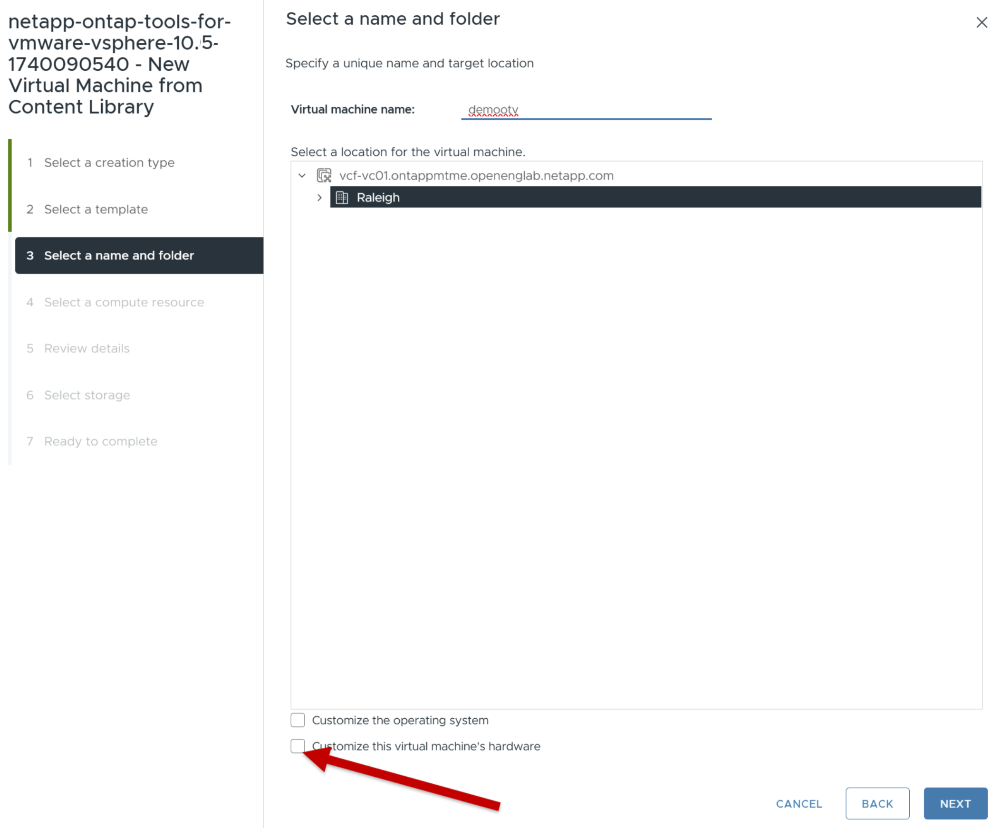
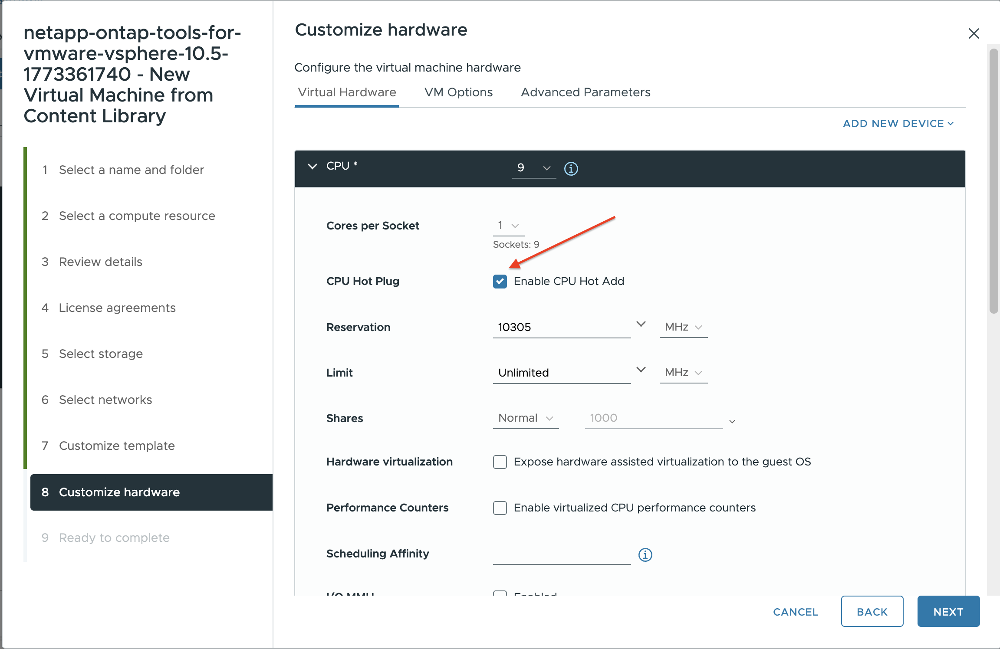

= Implementa las herramientas ONTAP
:allow-uri-read: 
:icons: font
:imagesdir: ../media/

[role="lead"]
Las ONTAP tools for VMware vSphere se implementan como un único nodo de tamaño pequeño con servicios centrales para admitir almacenes de datos NFS y VMFS. El proceso de implementación de las herramientas ONTAP puede tardar hasta 45 minutos.

.Antes de empezar
Si está implementando un solo nodo pequeño, una biblioteca de contenido es opcional.  Para implementaciones de múltiples nodos o de alta disponibilidad, se requiere una biblioteca de contenido.  En VMware, una biblioteca de contenido almacena plantillas de VM, plantillas de vApp y otros archivos.  La implementación con una biblioteca de contenido proporciona una experiencia perfecta porque no depende de la conectividad de la red.

Tenga en cuenta lo siguiente antes de crear una biblioteca de contenido:

* Cree la biblioteca de contenido en un almacén de datos compartido para que todos los hosts del clúster puedan acceder a ella.
* Configure la biblioteca de contenido antes de implementar las ONTAP tools for VMware vSphere OVA.
* Asegúrese de que la biblioteca de contenido se cree antes de configurar el dispositivo para HA.
+

NOTE: No elimine la plantilla OVA en la biblioteca de contenido después de la implementación.

NOTE: Para permitir el despliegue de HA en el futuro, evita desplegar la máquina virtual de ONTAP tools directamente en un host ESXi. En su lugar, despliega la máquina virtual dentro de un clúster de hosts ESXi o pool de recursos.

Siga estos pasos para crear una biblioteca de contenido:

. Descargue el archivo que contiene los binarios (_.ova_) y los certificados firmados para las ONTAP tools for VMware vSphere desde  https://mysupport.netapp.com/site/products/all/details/otv10/downloads-tab["Sitio de soporte de NetApp"^] .
. Inicie sesión en el cliente de vSphere
. Seleccione el menú del cliente vSphere y seleccione *Bibliotecas de contenido*.
. Selecciona *Crear* a la derecha de la página.
. Proporcione un nombre para la biblioteca y cree la biblioteca de contenido.
. Vaya a la biblioteca de contenido que ha creado.
. Selecciona *Acciones* a la derecha de la página, selecciona *Importar elemento* e importa el archivo OVA.

NOTE: Para obtener más información, consulte https://blogs.vmware.com/vsphere/2020/01/creating-and-using-content-library.html["Creación y Uso de la Biblioteca de Contenido"] el blog.

NOTE: Antes de proceder con el despliegue, configura el Programador de recursos distribuidos (DRS) del clúster en Conservador. Esto garantiza que las máquinas virtuales no se migren durante la instalación.

Las ONTAP tools for VMware vSphere se despliegan inicialmente como una configuración no HA. Para escalar a un despliegue HA, necesitarás habilitar la incorporación en caliente de CPU y la memoria conectable en caliente. Puedes realizar este paso como parte del proceso de despliegue o editar la configuración de la máquina virtual después del despliegue.

.Pasos
. Descargue el archivo que contiene los binarios (_.ova_) y los certificados firmados para las ONTAP tools for VMware vSphere desde  https://mysupport.netapp.com/site/products/all/details/otv10/downloads-tab["Sitio de soporte de NetApp"^] Si ha importado el OVA a la biblioteca de contenido, puede omitir este paso y continuar con el siguiente.
. Inicie sesión en vSphere Server.
. Vaya al grupo de recursos, clúster o host donde desea implementar el OVA.
+

NOTE: Nunca almacenes la máquina virtual de ONTAP tools for VMware vSphere en los almacenes de datos vVols que gestiona.

. Puede implementar el OVA desde la biblioteca de contenido o desde el sistema local.
+
|===

| Del sistema local | De la biblioteca de contenido 

| a. Haga clic con el botón derecho del ratón y seleccione *Implementar plantilla OVF...*. b. Elija el archivo OVA de la URL o vaya a su ubicación y, a continuación, seleccione *Siguiente*. | a. Vaya a la biblioteca de contenidos y seleccione el elemento de biblioteca que desea implementar. b. Seleccione *Acciones* > *Nueva VM desde esta plantilla* 
|===
. En el campo *Seleccione un nombre y carpeta*, introduzca el nombre de la máquina virtual y elija su ubicación.
+
** Si estás usando la versión vCenter Server 8.0.3, selecciona la opción *Personalizar el hardware de esta máquina virtual*, lo que activará un paso adicional llamado *Personalizar hardware* antes de pasar a la ventana *Listo para finalizar*.
** Si estás usando la versión vCenter Server 7.0.3, sigue los pasos de la sección *¿Qué sigue?* al final de la implementación. 

. Seleccione un recurso informático y seleccione *Siguiente*. Opcionalmente, marque la casilla para *encender automáticamente la VM implementada*.
. Revisa los detalles de la plantilla y selecciona *Siguiente*.
. Lea y acepte el contrato de licencia y seleccione *Siguiente*.
. Seleccione el almacenamiento para la configuración y el formato de disco y seleccione *Siguiente*.
. Seleccione la red de destino para cada red de origen y seleccione *Siguiente*.
. En la ventana *Personalizar plantilla*, rellena los campos obligatorios. image:../media/custom-temp-p2.png["Personalizar plantilla"]
+

NOTE: El nombre de host de vCenter es el nombre de la instancia de vCenter Server donde se implementa el dispositivo de herramientas ONTAP .

+
Si estás desplegando herramientas ONTAP en una topología de dos vCenter Server, donde el appliance está alojado en una instancia de vCenter y gestiona otra, puedes asignar un rol restringido para la instancia de vCenter que aloja las herramientas ONTAP. Puedes crear un usuario y un rol dedicados de vCenter con solo los permisos necesarios para el despliegue de plantillas OVF. Para más detalles, consulta los roles listados en link:../concepts/rbac-vcenter-use.html#vsphere-object-hierarchy["Roles incluidos con las herramientas de ONTAP para VMware vSphere 10"].

+
Para la instancia de vCenter que será administrada por las herramientas de ONTAP , asegúrese de que la cuenta de usuario de vCenter tenga privilegios de administrador.

+
** Los nombres de host deben incluir letras (A-Z, a-z), dígitos (0-9) y guiones (-). Para configurar la pila dual, especifique el nombre de host asignado a la dirección IPv6.
+

NOTE: No se admite Pure IPv6. El modo mixto es compatible con VLAN que contiene direcciones IPv6 e IPv4.

** La dirección IP de ONTAP Tools es la interfaz principal para la comunicación con las herramientas de ONTAP.
** IPv4 es el componente de dirección IP de la configuración del nodo, que se puede utilizar para habilitar el shell de diagnóstico y el acceso SSH en el nodo con fines de depuración y mantenimiento.

. Cuando utilices la versión vCenter Server 8.0.3, en la ventana *Personalizar hardware*, activa las opciones *CPU incorporación en caliente* y *Memoria conectable en caliente* para permitir la funcionalidad de HA.  image:../media/customize-hw105-p2.png["Memoria conectable en caliente"]
. Revise los detalles en la ventana *Listo para completar*, seleccione *Finalizar*.
+
A medida que se crea la tarea de implementación, el progreso se muestra en la barra de tareas de vSphere.

. Encienda el equipo virtual después de completar la tarea si no se ha seleccionado la opción de encender automáticamente el equipo virtual.

Puede realizar un seguimiento del progreso de la instalación dentro de la consola web de la máquina virtual.

Si hay discrepancias en el formulario OVF, un cuadro de diálogo solicitará una acción correctiva.  Utilice el botón de tabulación para navegar, realizar los cambios necesarios y seleccionar *Aceptar*.  Tiene tres intentos para resolver cualquier problema.  Si los problemas continúan después de tres intentos, el proceso de instalación se detendrá y se recomienda volver a intentar la instalación en una nueva máquina virtual.

.¿Cuál es el siguiente?
Si has desplegado ONTAP tools for VMware vSphere con vCenter Server 7.0.3, entonces sigue estos pasos después del despliegue.

. Inicie sesión en el cliente de vCenter
. Apague el nodo de herramientas ONTAP.
. Vaya a las ONTAP tools for VMware vSphere en *Inventarios* y seleccione la opción *Editar configuración*.
. En las opciones de *CPU*, marca la casilla de verificación *Enable CPU hot add*
. En las opciones de *Memoria*, marque la casilla de verificación *Habilitar* contra *Memory hot plug*.

