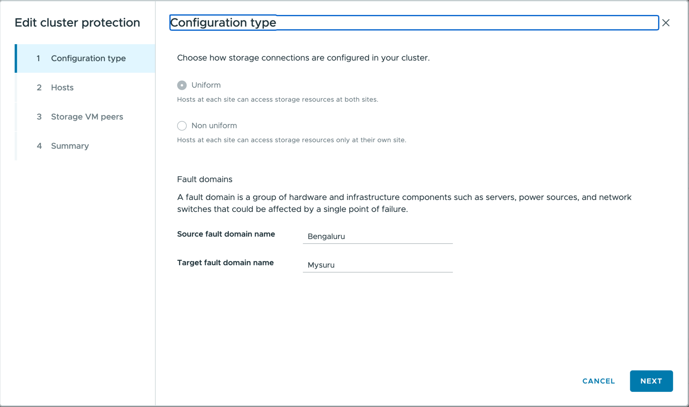

= Configura el clúster para la protección del almacén de datos con ONTAP tools
:allow-uri-read: 
:icons: font
:imagesdir: ../media/

[role="lead"]
Utiliza ONTAP tools for VMware vSphere para configurar la configuración del clúster (proximidad host-almacenamiento), lo que permite una protección eficiente de los datastores y una gestión de failover simplificada para tu entorno virtualizado.

.Antes de empezar
* Comprueba que dispones de privilegios de administración en vSphere.
* Los parámetros de configuración del clúster se aplican tanto a configuraciones uniformes como a no uniformes, mientras que los parámetros de acceso solo se aplican a las relaciones de tipo AFD.

.Pasos
. En el cliente de vSphere, haz clic con el botón derecho en el clúster de hosts y selecciona *Configurar la protección del clúster*.
+

NOTE: Si el clúster ya cuenta con una configuración de clúster, esta opción te permite editar la configuración existente.

. En la ventana *Tipo de configuración*:
+
.. Selecciona *Uniform* para permitir que los hosts de ambos dominios de fallo accedan a los recursos de almacenamiento en ambos sitios. Un dominio de fallo es un grupo de componentes de hardware e infraestructura. Asigna cada host a un dominio de fallo para ambos sitios.
.. Selecciona *No uniforme* para restringir que los hosts de cada sitio accedan al almacenamiento solo en su respectivo sitio. Asigna los hosts a los dominios de fallo según corresponda.
.. Introduce los nombres de dominio de fallo. Los nombres predeterminados son "Site A" y "Site B". Puedes editar estos valores. Los nombres de los sitios se asignan a los dominios de fallo de origen y destino. La interfaz de usuario valida las entradas a medida que escribes y muestra mensajes en caso de caracteres no admitidos o valores que superan el límite de caracteres.
+

NOTE: El tipo de configuración no se puede modificar una vez establecido. Para cambiar el tipo de configuración, elimina la configuración del clúster y crea una nueva con los ajustes deseados.

. Seleccione *Siguiente*.
. En la ventana *Hosts*, asigna cada host al dominio de fallo de origen o al dominio de fallo de destino. Todos los hosts deben estar asignados y un host no puede pertenecer a ambos sitios. Los nombres de los sitios que aparecen en el asistente son los nombres de los dominios de fallo de origen y de destino. El botón *Siguiente* se activa una vez que se han asignado todos los hosts.
. Seleccione *Siguiente*.
. En la página *Peers de SVM de almacenamiento*, asigna cada SVM al sitio correspondiente. Puedes asignar varios peers de SVM, pero debes asignar al menos uno a cada sitio. Cuando asignas un SVM a un sitio, su peer de SVM se asigna automáticamente al sitio opuesto.
. Seleccione *Siguiente*.
. Revisa la página *Resumen*. Confirma la configuración del clúster para los dominios de fallo correspondientes.
. Selecciona *Crear* para aplicar la configuración.
. Para ver o modificar una configuración de protección de clúster ya existente:
+
.. Ve a la vista del complemento ONTAP tools.
.. Ve a *Protección* > *Configuración de la protección del clúster*.
.. Selecciona el clúster para ver su configuración actual.
.. Haz clic en los tres puntos verticales y selecciona *Editar* para modificar la configuración. El asistente muestra los ajustes actuales para editar.
+

.Resultado
La configuración se aplica y puedes verla o editarla en el plugin de ONTAP tools.
